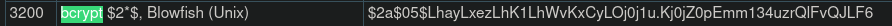

<!-- # TryHackMe — Crack the Hash -->

In this article you will find step-by-step instructions to solve the Crack The Hash challenge on TryHackMe platform (https://tryhackme.com/room/crackthehash).

Oh, by the way…. Welcome aboard, reader! You are on my first blog post!

## Introduction
*I will use the prefix "T.Q" in titles: "T" for Task and "Q" for Question. E.g. T1.Q1 means that it is Task 1, Question 1.*

*I will also attach screenshot to each step till I find the solution. The answers in the screenshots will be hidden with a red line.*

Some tips:
- It would be good to have some basic cryptology knowledge.
- Have Kali Linux installed (e.g. on Virtualbox), with at least 4 GB memory. If less, you may have an error informing that there is not enough allocatable device memory.

- I mainly used hashcat tool and the world-wide famous rockyou wordlist.
- I additionally used md5decrypt.net online tool for encryption and decryption operations.
- Another useful link will be the example hashes page to check hash-modes which we will need: https://hashcat.net/wiki/doku.php?id=example_hashes

## Solutions

### T1.Q1 - 48bb6e862e54f2a795ffc4e541caed4d

Hmm. So let's try the MD5 Decryption:

Got it!

### T1.Q2 – CBFDAC6008F9CAB4083784CBD1874F76618D2A97
So again, we check the hash type.

Guess it is SHA-1! Let's try to decrypt it:

Got it too!

### T1.Q3–1C8BFE8F801D79745C4631D09FFF36C82AA37FC4CCE4FC946683D7B336B63032

As always, we start from a visit to Hash Type detector.

We have the SHA-256 decryption tool available on this online tool, so let's try it and see if it works.

Here we go!

### T1.Q4 - $2y$12$Dwt1BZj6pcyc3Dy1FWZ5ieeUznr71EeNkJkUlypTsgbX1H68wsRom

Let's have a look at the beginning of this hash.

**$2y$12$…**

This seems to be a pattern? Let's check it on Hash Type detector first.

So let's *duckduckgo* it.

So let's see what Wikipedia says about Bcrypt.

Hmm. I guess this is high time we check the example hashes list on hashcat tool's page.

Okay, so let's try! Let's switch to our Kali Linux on Virtualbox and check hashcat - help command.

Ugh. That's some long documentation, a very long one… I prefer to check some tutorial(s) which are (in my opinion) easier to understand than this "raw manual".

So, I finally find what I needed.

> *hashcat -m 3200 -a 0 ‘$2y$12$Dwt1BZj6pcyc3Dy1FWZ5ieeUznr71EeNkJkUlypTsgbX1H68wsRom’ /usr/share/wordlists/rockyou.txt*

So everything seems okay, then I check the status and I see this:

No, thank you. I don't have that much time. So what now? I decide to check the hint for this question.

Okay. So let's filter the rockyou.

> awk 'length == 4' /usr/share/wordlists/rockyou.txt > rock4.txt

We are good to go! Now we use this rock4.txt as our wordlist file.

> hashcat -m 3200 -a 0 '$2y$12$Dwt1BZj6pcyc3Dy1FWZ5ieeUznr71EeNkJkUlypTsgbX1H68wsRom' rock4.txt

So here it is, we got the next answer!

### T1.Q5 - 279412f945939ba78ce0758d3fd83daa

Last challenge in level 1 tasks. Traditionally, I will start from Hash Type Detector.

I will be able to solve it immediately on this online tool if it is MD5 or MD4. Let's try MD5 first.

Okay. So hopefully it is MD4.

So, we have the last answer in first task.

### T2.Q1 - F09EDCB1FCEFC6DFB23DC3505A882655FF77375ED8AA2D1C13F640FCCC2D0C85

Hash Type Detector:

Let's try SHA-256 decryption.

That was too easy for 2nd level tbh.

### T2.Q2 - 1DFECA0C002AE40B8619ECF94819CC1B

So our beloved friend helps us detect what kind of hash that might be:

And then we just try to decrypt it on the same tool. First MD5:

Oh, here you are!

### T2.Q3 - $6$aReallyHardSalt$6WKUTqzq.UQQmrm0p/T7MPpMbGNnzXPMAXi4bJMl9be.cfi3/qxIf.hsGpS41BqMhSrHVXgMpdjS6xeKZAs02.

**salt: aReallyHardSalt**

So, this time it is something completely different. Let's check $6$ on hashcat example hashes list:

Oh so here it is.

> hashcat -a 0 -m 1800 '$6$aReallyHardSalt$6WKUTqzq.UQQmrm0p/T7MPpMbGNnzXPMAXi4bJMl9be.cfi3/qxIf.hsGpS41BqMhSrHVXgMpdjS6xeKZAs02.' /usr/share/wordlists/rockyou.txt

Okay, so last time we had a similar situation, we had an information about the length of the target word. This time we do not have it directly given, but looking at the placeholder in the answer field, we can reach to a conclusion that the answer is 6 characters long.

> awk 'length == 6' /usr/share/wordlists/rockyou.txt > rock6.txt

Now, we just should run the following command and wait for the answer to reveal itself:

> hashcat -a 0 -m 1800 '$6$aReallyHardSalt$6WKUTqzq.UQQmrm0p/T7MPpMbGNnzXPMAXi4bJMl9be.cfi3/qxIf.hsGpS41BqMhSrHVXgMpdjS6xeKZAs02.' rock6.txt

It took longer than the rest, but we got the answer. So, let's proceed to the last one!

### T2.Q4 - e5d8870e5bdd26602cab8dbe07a942c8669e56d6

**salt: tryhackme**

We find the hash type first.

Then, we check it on SHA1 Decryption tool:

No success. So we will use hashcat, but first, we should find the hash mode number:

Which one? Taking into account the key length, it should be either 110 or 160. I will start with 110.

> hashcat -a 0 -m 110 'e5d8870e5bdd26602cab8dbe07a942c8669e56d6:tryhackme' /usr/share/wordlists/rockyou.txt

Apparently not this one. Let's try 160.

> hashcat -a 0 -m 160 'e5d8870e5bdd26602cab8dbe07a942c8669e56d6:tryhackme' /usr/share/wordlists/rockyou.txt

Here it is! We have the last answer!

## Conclusion

Cracking hashes is fun, is not it? :)

Thank you for reading my first article on this platform. I hope it helped you complete this room. See you in another one!