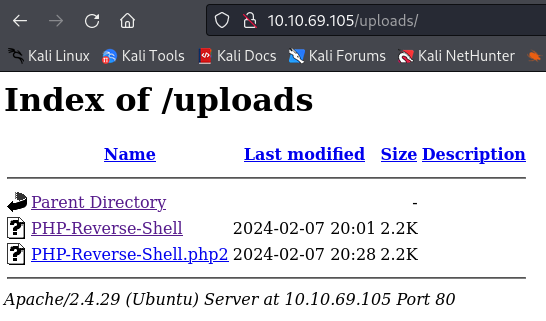

In this article you will find step-by-step instructions to solve the Root Me challenge on TryHackMe platform (https://tryhackme.com/room/rrootme).

## Introduction
*I will use the prefix “T.Q” in titles: “T” for Task and “Q” for Question. E.g. T1.Q1 means that it is Task 1, Question 1.*

*I will also attach screenshot to each step till I find the solution. The answers in the most of the screenshots will be hidden with a red line.*

So, let's start!

## Solutions

### T1 — Deploy the machine

Nothing to do here. Start the machine and connect to it. Write down the IP address of your machine.

### T2 — Reconnaissance

This task is about collecting information about the target machine.

### T2.Q1 — How many ports are open?

Let’s check nmap documentation.

Hmm. Let’s scan ports sequentially:

> nmap -r 10.10.69.105

Here it is! Write the number of displayed ports on the list as an answer.

### T2.Q2 — What version of Apache is running?

Let’s see if we have anything that can be used for this purpose in nmap help.

This should be it. Let’s try:

> nmap -sV 10.10.69.105

Here it is. We have the answer in the Version column of this table.

### T2.Q3 - What service is running on port 22?

To scan a specific port, we should use -p parameter.

> nmap -p 22 10.10.69.105

We have the answer in the last column of the table.

### T2.Q4 - Find directories on the web server using the GoBuster tool.

Since the question itself provides a tip, I check the hint to see what I should do, and adjust it to my need. So, what wordlist should I use?

Hmm. Dirb and dirbuster are probably related with directories. So let's check what do we have in dirbuster.

Let's start with "directory-list-2.3-small.txt". So our command is as following:

> gobuster dir -u 10.10.69.105 -w /usr/share/wordlists/dirbuster/directory-list-2.3-small.txt

It took some time, but here it is. Since there is not any answer needed in this question, I will just proceed to the next question.

### T2.Q5 - What is the hidden directory?

Answer is 5 characters long. We already found a directory which is 5 characters long (which can be seen in the screenshot above). So we shall write it in slashes in the Answer field of this question and see if it is the right answer.

(It is the right answer, yes)

### T3.Q1- Find a form to upload and get a reverse shell, and find the flag.

We already found out that this address has /uploads directory (check the screenshot from T2.Q3). Let's inspect it a bit closer. I will start from checking it on browser:

I tried "add", "new" and "upload directories by adding them to this address. No result.

Let's see the /panel directory.

Well, well, well. I guess this is going to be our form to get a reverse shell. Let's google 'apache reverse shell'. First result leads me to this Github repo: https://github.com/xdayeh/Php-Reverse-Shell

I will clone this repo to my machine, modify the file and upload it on /panel directory.

PHP file is not allowed, it seems. Hmm. So let's inspect the HTTP request and see if we can bypass it somehow.

Okay. I guess we may try to change Content-Type to application/json and see if it goes through?

So, no. It won't work this way. It is too late here, and I can not think of anything right now. But duckduckgo may help me in this one!

So I open the first link and find the following information:

So let's try each of them one by one.

So, we could upload our reverse shell file successfully. I can verify that when I open the /uploads directory:

Now, I should do what it says in the description of the Reverse Shell script.

I will get ready to catch the reverse shell.

Then I open the file I uploaded on the browser.

Ups. So what did I do wrong? I will repeat it using Burp Suite and see what exactly is going on. Let's try other extensions.

So let's find the user.txt file. Let's try it using 'find' command:

> find -name 'user.txt'

Here it is! So let's display its content:

We found the flag!

### T4 - Privilege Escalation

### T4.Q1 - Search for files with SUID permission, which file is weird?

Had to duckduckgo this one.

So, let's try:

> find . -perm /4000

The output is full of "Permission denied"s. But what this file is doing there? Let's see if it is our answer.

(of course it is)

### T4.Q2 - Find a form to escalate your privileges

No answer is needed here. So, from T4.Q1 we know that python has a SUID bit set. I will check gtfobins.github.io page and hopefully find a way to escalate my privileges.

I think this might help us! We can skip the first command since our python already has a SUID bit set. So:

> ./python -c 'import os; os.execl("/bin/sh", "sh", "-p")'

Say hello to your ROOT! :D

### T4.Q3 - root.txt

So, since we are having root privileges, let's see where the root.txt file is located. Let's cd to "/" directory and run the following command:

> find -name root.txt

Here we go! Last question is completed as well!

So let's "cat" this file and find the flag!

## Conclusion

This challenge is an easy one, is not it? :)
Thank you for reading my write-up for the RootMe room on tryhackme platform. I hope you also enjoy these challenges as much as I do. See you in next one!